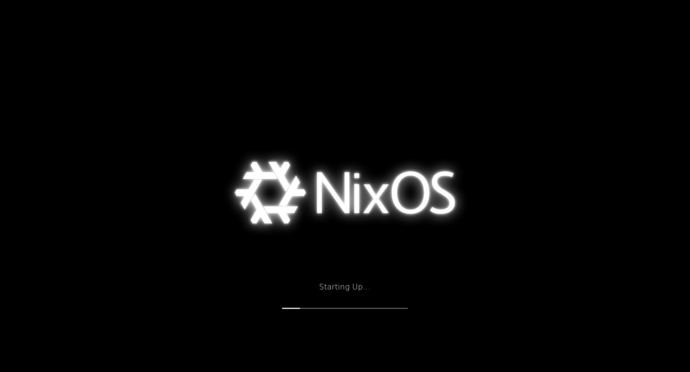

## NixOS Plymouth

This repo contains a plymouth theme for NixOS that pulses the NixOS logo. Please check out the credits section for all the work that inspired this.



**Warning: Using this repo for some reason bloats the `initrd` quite a bit (up to 50 MB). Use it with [boot.loader.systemd-boot.configurationLimit](https://search.nixos.org/options?channel=23.05&show=boot.loader.systemd-boot.configurationLimit&from=0&size=50&sort=relevance&type=packages&query=systemd-boot) or a `/boot` of at least a gigabyte.
On EFI Systems it's also possible to keep the initrd on the main partition when switching to Grub. Checkout the [nixos wiki](https://wiki.nixos.org/wiki/Bootloader#Keeping_kernels/initrd_on_the_main_partition).**

# Install

The package is currently not in nixpkgs.

## Flakes

You can include it in your `flakes.nix` like this:

```nix
{
  inputs.nixos-plymouth.url = "github:BeatLink/nixos-plymouth";;
  outputs = { self, nixpkgs, nixos-plymouth }:
  {
    nixosConfigurations."<hostname>" = nixpkgs.lib.nixosSystem {
      modules = [ 
        nixos-plymouth.nixosModules.default 
        ... 
      ];
      system  = "x86_64-linux";
    };
  };
}

```

## Non Flakes

You can include it in your `configuration.nix` like this:

```nix
{ config, lib, pkgs, ...}:
let
  # Fetch the repository
  nixos-plymouth-src = pkgs.fetchFromGitHub {
    owner = "BeatLink";
    repo = "nixos-plymouth";
    rev = "main";
    sha256 = "sha256-<hash>";
  };
in
{
  imports = [ "${nixos-plymouth-src}/modules.nix" ];
}
```

## Configuration

No configuration is needed. The theme will automatically enable plymouth and set the theme to itself.

## Building The Theme

These instructions are basically how this theme was generated

1. Generate NixOS Logo from branding repo
2. Edit in inkscape
   1. Group logo and center in background layer
   2. Duplicate logo group and set blur to 15%
   3. Duplicate logo and set blur to 30%
   4. Group both blurs
3. Animate in xyris.app
   1. Create pulse animation
      1. Set logo opacity to 100 and blur layer opacity to 100
      2. Animate blur layer
      3. Set keyframe at the following positions with the following opacities for the blur layer
         1. 0s 0%
         2. 2.5s 100%
         3. 3s   100%
         4. 5.5s 0%
         5. 6s   0%
      4. Set ease in to all transitions
      5. Export as svg
4. Convert animated svg to png frames
5. Run the following:
   ``bash nix-shell -p nodejs ungoogled-chromium cd tools/render-svg-frames export PUPPETEER_EXECUTABLE_PATH=$(which chromium) export PUPPETEER_SKIP_DOWNLOAD=true npm install puppeteer node render-svg-frames.js '../../resources/nixos-logo-animated.svg' ``
6. Copy the resulting throbber images to `src/resources`
7. Use inkscape to convert the icons in `resources/current` or other desired svgs to png and move to `src/resources`
8. Edit the plymouth file as desired

## Testing the changes

Once your host system has been configured:

1. Update your flake
2. Rebuild your system `using nixos-rebuild`
3. Run the following `sudo plymouthd ; sudo plymouth --show-splash ; sleep 10 ; sudo killall plymouthd`

## Credits

* Creating Glows in SVGs - www.youtube.com/watch?v=oe8RB4Y6Vi4
* NixOS-Boot - https://github.com/Melkor333/nixos-boot
